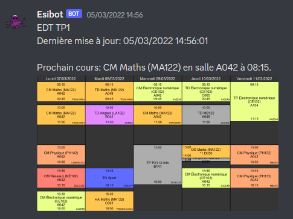

# Esibot
Esibot is a Discord bot programmed in Python that regularly downloads, parses, and displays the weekly schedule from the Esisar school servers.
It supports the iCalendar format and converts it into a well-presented, colored image that is then published on a Discord text channel.

The "configs.py" file allows you to create as many schedules as you want, each being published on a different Discord channel and having different visual customization. A color can be associated with each subject and it is possible to rename the subjects using this configuration file. On weekends, the schedule for the following week is automatically downloaded. During the week, a timeline scrolls through the corresponding day.

Esibot accompanies the weekly schedule with a short message indicating the name, room, and time of the next class in order to save time for students.

Esibot was developed at the beginning of my first year of prep at the Esisar school due to the complexity of accessing the official schedule and the poor presentation of it.

The bot worked for an entire year before it was stopped due to the difficulty of hosting it on free servers.
Esibot was last updated in March 2022. No bugs were reported between this date and its discontinuation in June 2022. If someone wishes to restart the program, they are welcome to use my code.

